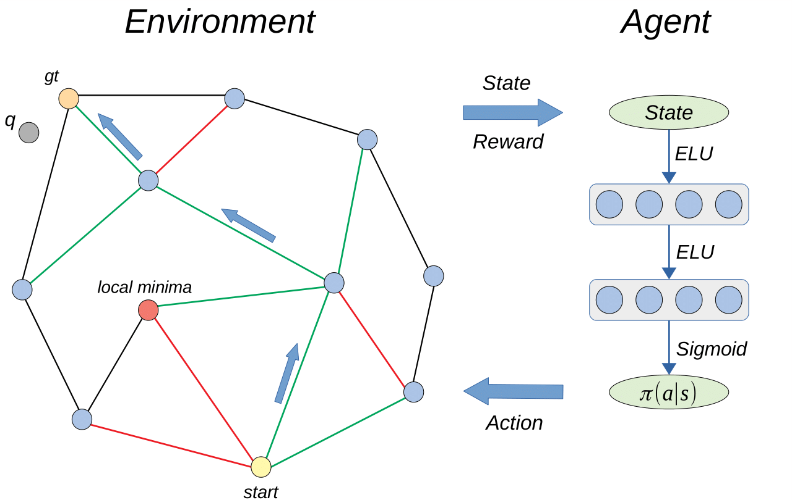

# Graph Based Nearest Neighbor Search meets Deep Reinforcement Learning 
A supplementary code for anonymous NeurIPS 2019 submission.

# What does it do?
It learns a graph for fast nearest neighbor search with TRPO.



# What do I need to run it?
* A single GPU and as many CPUs as you can find
* Use any popular 64-bit Linux operating system
  * Tested on Ubuntu16.04, should work fine on most linux x64 and even MacOS;
  * On other operating systems we recommend using Docker, e.g. [pytorch-docker](https://hub.docker.com/r/pytorch/pytorch)
* Install the libraries required to compile C++ parts of our framework
  * ```sudo apt-get install gcc g++ libstdc++6 wget curl unzip git```
  * ```sudo apt-get install swig3.0``` (or just swig)
  

# How do I run it?
1. Clone or download this repo. `cd` yourself to it's root directory.
2. Grab or build a working python enviromnent. [Anaconda](https://www.anaconda.com/) works fine.
3. Install packages from `requirements.txt`
4. Open jupyter notebook in `./notebooks/` and you're done!
